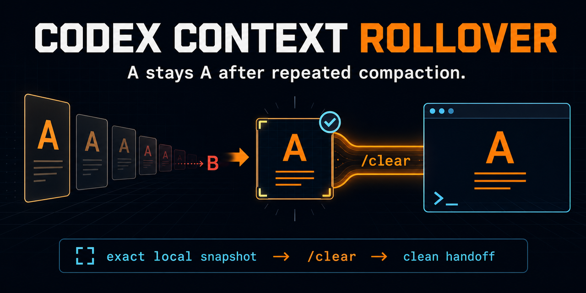

<p align="center">
  
</p>

<h1 align="center">Codex Context Rollover</h1>

<p align="center"><strong>Keep objective A from quietly becoming B after repeated Codex compaction.</strong></p>

<p align="center">
  <a href="https://github.com/ulofiai/codex-context-rollover/actions/workflows/test.yml"></a>
  <a href="https://github.com/ulofiai/codex-context-rollover/releases/latest"></a>
  
  <a href="LICENSE"></a>
</p>

<p align="center">
  <a href="README.zh-TW.md">繁體中文</a> ·
  <a href="#install-in-two-commands">Install</a> ·
  <a href="#what-happens-at-compaction-2">How it works</a> ·
  <a href="https://github.com/ulofiai/codex-context-rollover/issues">Report a drift case</a>
</p>

## The 10-second version

A long Codex task can be summarized, then summarized again. The task still looks normal, but an original constraint disappears—or objective **A** quietly drifts into **B**.

Context Rollover catches the second compaction and prepares a clean escape hatch:

```text
A → summary → summary → B                     repeated-summary drift
A → exact local snapshot → /clear → A         Context Rollover
```

- Saves a **byte-for-byte local transcript snapshot** with a SHA-256 boundary.
- Carries the **verbatim original and latest user-message anchors**, not another AI-written summary.
- Gives explicit `/clear` a **short-lived, one-time handoff** into a clean session.
- Gives ordinary `/new` **nothing**, so an unrelated task cannot inherit stale intent.
- Expires pending handoffs and prunes old snapshots automatically.

No polling. No prompt wrapper. No background service. No cloud account. No telemetry. No package dependencies.

## Install in two commands

Requirements: Codex with plugin/hooks support, Git, and Node.js 20 or newer. There is no `npm install` step.

```shell
codex plugin marketplace add ulofiai/codex-context-rollover
codex plugin add codex-context-rollover@codex-context-rollover
```

Restart Codex or open a new task, then run `/hooks` once to review and trust the command hook. Codex requires this one-time review for third-party command hooks.

That is the entire installation. There are no machine-specific paths, project files, credentials, databases, or previous state to migrate.

## What happens at compaction #2

```text
PostCompact #2
    └─ exact local snapshot + SHA-256 + verbatim user anchors
         └─ short-lived, single-use handoff armed
              ├─ /clear  → clean session receives the handoff once
              └─ /new    → receives nothing and stays unrelated
```

The plugin never blocks compaction, interrupts tools, or rewrites prompts. Every hook result keeps Codex running with `continue: true`; the only user action is the explicit `/clear` that chooses to carry the current task forward.

| Pain in a long task | What Context Rollover changes |
| --- | --- |
| You notice drift only after work goes wrong | The actual compaction count is recorded per task |
| Recovery depends on yet another summary | The exact transcript boundary is preserved locally |
| A clean session means rebuilding context by hand | `/clear` receives exact original and recent user anchors once |
| Automatic carry-over can contaminate a new objective | `/new` is intentionally isolated |
| Recovery files can accumulate forever | Retention and expiry clean them automatically |

## What is recorded

After every automatic or manual compaction, the plugin writes state under Codex's writable `${PLUGIN_DATA}` directory. From the configured threshold onward, it also saves an exact transcript snapshot and arms a workspace-scoped handoff:

```text
sessions/<sha256-of-session-id>/
├── state.json
├── 0002-<utc-timestamp>-<nonce>.json
└── 0002-<utc-timestamp>-<nonce>.transcript.jsonl
pending/
└── <sha256-of-working-directory>.json
```

Each checkpoint records:

- compaction count and timestamp;
- transcript path and captured byte boundary;
- SHA-256 of the transcript up to that boundary;
- trigger, turn ID, and working directory.

The pending handoff additionally stores the exact original and recent user-message anchors needed for one-time continuity.

The threshold snapshot is a **byte-for-byte local copy** up to the captured boundary. It never leaves the computer. Only the newest configured number of snapshots are retained, and the pending handoff expires automatically.

## What it solves—and what it does not

It solves the rollover problem without asking another model summary to summarize an already summarized task. `/clear` creates a genuinely clean Codex session, while `SessionStart source: clear` provides a safe, explicit signal to inject the single-use handoff. Verbatim user-message anchors preserve the original objective and latest constraints; the lossless snapshot remains available for evidence.

It does not click `/clear` for you or silently continue through `/new`. That one explicit command is the consent boundary that prevents a pending objective from leaking into an unrelated task.

### Why `/clear`, not `/new`

Codex exposes `/clear` as `SessionStart source: clear`, while an ordinary new task starts separately. Context Rollover matches only the explicit `clear` source, the same working directory, a short expiry, and one unconsumed handoff. That native distinction is what makes automatic continuation possible without globally guessing which old task a new conversation belongs to. See the [official Codex hooks event reference](https://learn.chatgpt.com/docs/hooks#sessionstart).

## Configuration

| Environment variable | Default | Purpose |
| --- | --- | --- |
| `CODEX_CONTEXT_ROLLOVER_THRESHOLD` | `2` | First compaction count that arms the `/clear` handoff |
| `CODEX_CONTEXT_ROLLOVER_LOCALE` | `zh-TW` | Set to `en` for English messages |
| `CODEX_CONTEXT_ROLLOVER_DATA` | Codex `${PLUGIN_DATA}` | Data-directory override for isolated testing |
| `CODEX_CONTEXT_ROLLOVER_HANDOFF_TTL_MINUTES` | `30` | How long `/clear` may consume the one-time handoff |
| `CODEX_CONTEXT_ROLLOVER_SNAPSHOT_RETENTION` | `2` | Lossless snapshots retained per source session |

## Privacy and failure behavior

- All runtime records and lossless snapshots stay on the local computer.
- Session IDs are SHA-256 hashed before becoming directory names.
- No network request, telemetry, token, or account is used.
- Atomic writes plus session and workspace locks protect concurrent state updates.
- Expired, consumed, or excess handoff data is not replayed.
- Recording errors are reported, but the task always continues.

## Verification

The repository tests the real installed hook behavior—not a mock—on Windows, macOS, and Linux. Coverage includes lossless snapshots, exact-anchor extraction, one-time `/clear` consumption, `/new`/startup isolation, expiry, automatic retention, recording failure, and per-session counting.

For maintainers, verification uses Node directly:

```shell
node --check plugins/codex-context-rollover/scripts/context-rollover.mjs
node --test test/post-compact.test.mjs
```

## Remove

```shell
codex plugin remove codex-context-rollover
```

If a project already has another `PostCompact` hook with the same behavior, disable that duplicate before enabling this plugin globally. Codex runs every matching hook.

## License

[MIT](LICENSE)
